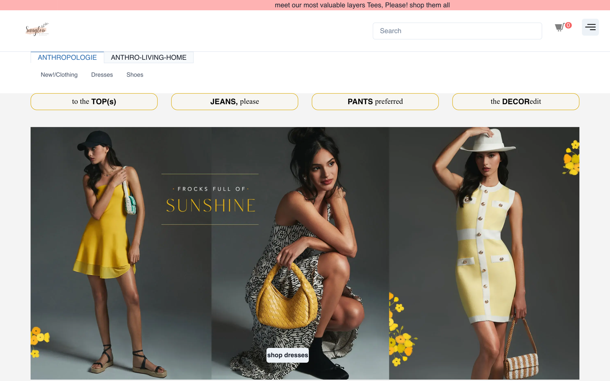
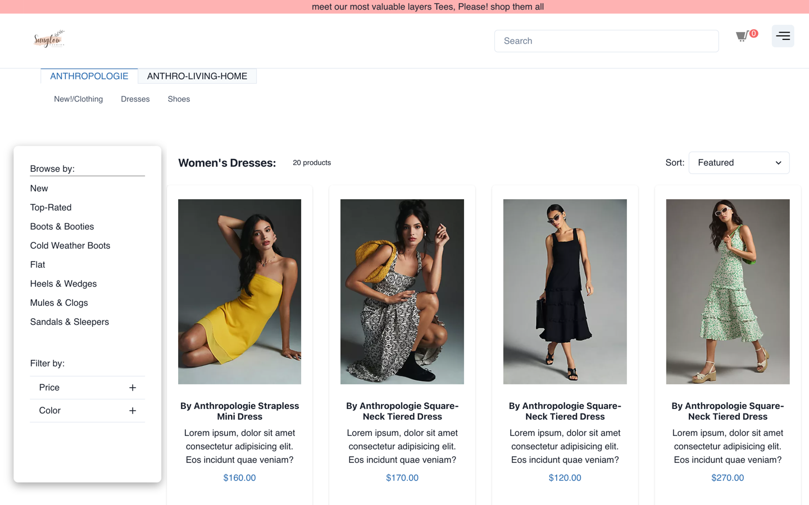
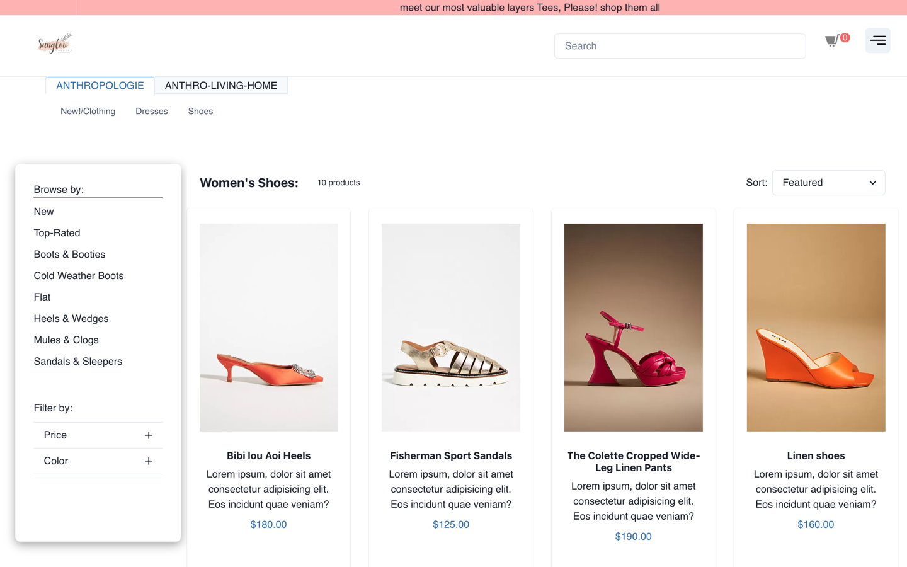
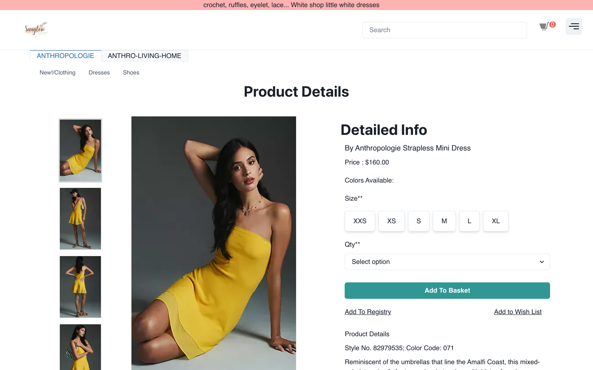
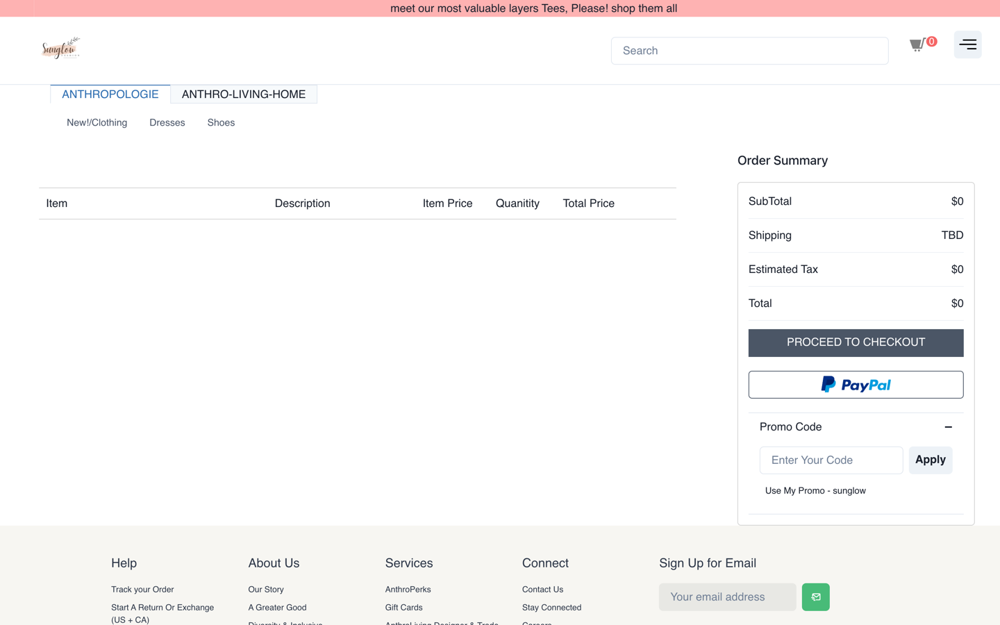
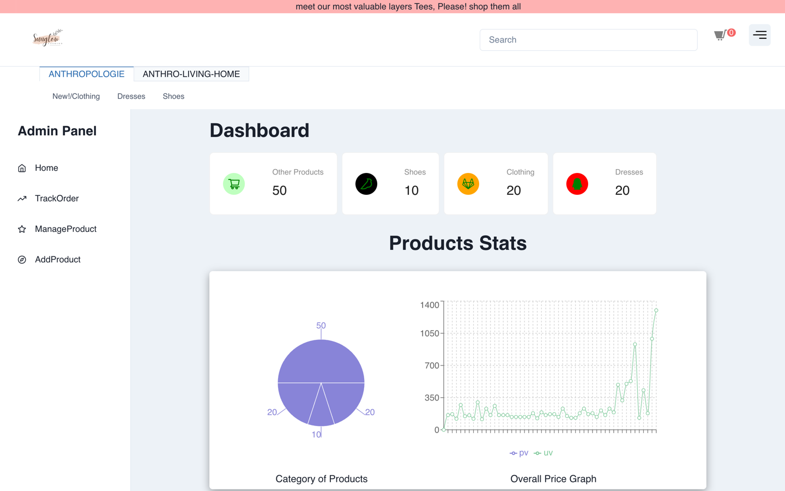

<div align="center">


# Sunglow Fashion

**A full-stack women's fashion e-commerce storefront with a built-in admin panel.**

Browse dresses, clothing and shoes, filter and sort them, run a complete
cart → shipping → payment → order checkout, and manage the whole catalogue
from an admin dashboard.

[](https://nextjs.org/)
[](https://react.dev/)
[](https://redux.js.org/)
[](https://chakra-ui.com/)
[](https://next-auth.js.org/)

### [🌐 Live Demo](https://unit-5-frontend-deployement.netlify.app/) · [🛠 Admin Panel](https://unit-5-frontend-deployement.netlify.app/Admin)

</div>

---

## Table of Contents

- [Overview](#overview)
- [Screenshots](#screenshots)
- [Features](#features)
- [Tech Stack](#tech-stack)
- [Getting Started](#getting-started)
- [Environment Variables](#environment-variables)
- [Project Structure](#project-structure)
- [Backend API](#backend-api)
- [Routes](#routes)
- [State Management](#state-management)
- [Known Issues](#known-issues)
- [Team](#team)

---

## Overview

Sunglow Fashion is a women's fashion storefront modelled on Anthropologie. It
is a Next.js 13 (pages router) application backed by a hosted `json-server`
REST API, with Redux for client state and Google OAuth for sign-in.

The project is split into two experiences that share one codebase:

| | |
|---|---|
| **Storefront** | Landing page, category browsing with filters and sorting, product detail pages, cart, promo codes, and a three-step checkout. |
| **Admin panel** | Catalogue statistics, product create/update/delete, and order fulfilment tracking. |

Product detail pages are statically generated at build time
(`getStaticPaths` + `getStaticProps`), and the site ships as a static export
(`next build && next export`) deployed to Netlify.

---

## Screenshots

### Landing page



### Category browsing — filters, sorting and pagination





### Product detail — gallery, size and quantity selection



### Cart and order summary



### Admin dashboard



---

## Features

### Storefront

- **Category browsing** — dedicated listings for Dresses, Clothing, Shoes and a
  combined All Products view.
- **Sorting** — Featured, Price: Low to High, Price: High to Low.
- **Filtering** — narrow results by price range and colour from the sidebar.
- **Pagination** — 5 products per page, with the current page reflected in the
  URL query string so listings are shareable.
- **Search** — type-ahead product search in the navbar with a results popover.
- **Product detail pages** — image gallery with side images, colour and size
  selection, star ratings and product details, statically pre-rendered.
- **Cart** — add, remove and change quantity; live subtotal, estimated tax and
  total.
- **Promo codes** — enter `sunglow` at the cart for 15% off the subtotal.
- **Checkout flow** — shipping address → payment details → payment method
  (card or cash on delivery) → order confirmation.
- **Order history** — customers can review the orders they have placed.
- **Google sign-in** — OAuth authentication via NextAuth.js.
- **Responsive** — layouts adapt from mobile through desktop using Chakra UI
  breakpoints.

### Admin panel

- **Dashboard** — live counts per category (Other Products, Shoes, Clothing,
  Dresses) plus a category pie chart and an overall price graph.
- **Add product** — create products in any category from a form (title, image
  URL, price, colour, size, details).
- **Manage products** — browse the full catalogue, edit existing products and
  delete them.
- **Track orders** — view incoming customer orders and toggle their
  fulfilment status.

---

## Tech Stack

| Layer | Technology |
|---|---|
| Framework | Next.js 13.2 (pages router) |
| UI library | React 18 |
| Component libraries | Chakra UI 2, Ant Design 5 |
| Styling | Emotion, CSS Modules, Framer Motion |
| State management | Redux + Redux Thunk, React Redux |
| Authentication | NextAuth.js (Google provider) |
| Charts | Recharts, Chart.js |
| Carousels | react-slick, react-multi-carousel |
| Icons | react-icons, Chakra Icons, Ant Design Icons |
| HTTP client | Axios |
| Mock backend | json-server hosted on Render |
| Hosting | Netlify (static export) |

---

## Getting Started

### Prerequisites

- Node.js 16 or newer
- npm

### Installation

```bash
git clone https://github.com/ParbhatKataria1/Sunglow-Fashion.git
cd Sunglow-Fashion/responsible-act-7116
npm install
```

### Run the development server

```bash
npm run dev
```

Open [http://localhost:3000](http://localhost:3000). The admin panel is at
[http://localhost:3000/Admin](http://localhost:3000/Admin).

> The app talks to the hosted Render API by default. Those instances sleep on
> the free tier, so the **first request after a period of inactivity can take
> up to a minute** while the service wakes up. Later requests are fast.

### Available scripts

| Command | Description |
|---|---|
| `npm run dev` | Start the Next.js development server on port 3000. |
| `npm run build` | Production build and static export to `out/` (114 pages). |
| `npm start` | Serve the production build. |
| `npm run lint` | Run ESLint via `next lint`. |

### Running the API locally (optional)

`db.json` in the app folder is the seed dataset (20 dresses, 20 clothing
items, 10 shoes, 40 combined products). To serve it locally instead of using
the hosted API:

```bash
npx json-server --watch db.json --port 8080
```

Then point `src/utils/url.js` and the `src/redux/**/**.api.js` files at
`http://localhost:8080`.

---

## Environment Variables

Google OAuth credentials are currently hardcoded in
[`next.config.js`](responsible-act-7116/next.config.js). **Move them to a
local, untracked `.env.local` file** and reference them via `process.env`:

```bash
# responsible-act-7116/.env.local
GOOGLE_CLIENT_ID=your-google-client-id
GOOGLE_CLIENT_SECRET=your-google-client-secret
JWT_SECRET=a-long-random-string
NEXTAUTH_URL=http://localhost:3000
```

Create the credentials in the
[Google Cloud Console](https://console.cloud.google.com/apis/credentials) and
add `http://localhost:3000/api/auth/callback/google` as an authorised redirect
URI.

`next.config.js` also allow-lists the remote image hosts used by the catalogue
(`images.urbndata.com`, `images.ctfassets.net`,
`serving.photos.photobox.com`, `th.bing.com`). Add any new image host there
before using it.

---

## Project Structure

```
Sunglow-Fashion/
├── docs/screenshots/            # README images
└── responsible-act-7116/        # the Next.js application
    ├── db.json                  # json-server seed data
    ├── next.config.js           # remote image hosts + env
    ├── public/                  # logo, favicons
    └── src/
        ├── components/
        │   ├── Admin/           # Dashboard, AddProduct, ProductsList,
        │   │                    # ProductItem, TrackOrder, Chart
        │   ├── Anthropologie.jsx      # landing page (fashion)
        │   ├── AnthrolivingHome.jsx   # landing page (home & living)
        │   ├── navbar.jsx             # nav, search, auth, cart badge
        │   ├── footer.jsx
        │   ├── ProductCard.jsx
        │   └── SlindingCard.jsx       # carousel card
        ├── pages/
        │   ├── index.js               # storefront home
        │   ├── Admin/index.jsx        # admin shell + sidebar
        │   ├── allproduct/            # listing + [id] detail
        │   ├── clothing/              # listing + [id] detail
        │   ├── dresses/               # listing + [id] detail
        │   ├── shoes/                 # listing + [id] detail
        │   ├── cartpage/index.jsx
        │   ├── shipping.jsx
        │   ├── payment.jsx
        │   ├── paymentOption.jsx
        │   ├── successpage.jsx
        │   ├── orders.jsx
        │   └── api/auth/[...nextauth].js
        ├── redux/                     # nav, cart, allProduct, order,
        │                              # shippingRedux + store
        ├── styles/
        └── utils/                     # api helpers, formatters
```

---

## Backend API

Two hosted `json-server` instances back the app:

**Catalogue and cart** — `https://apiserver-no4z.onrender.com`

| Method | Endpoint | Description |
|---|---|---|
| `GET` | `/dresses` | List dresses (20 items). |
| `GET` | `/clothing` | List clothing (20 items). |
| `GET` | `/shoes` | List shoes (10 items). |
| `GET` | `/allproduct` | List the combined catalogue. |
| `POST` | `/:category` | Create a product in a category. |
| `PATCH` | `/:category/:id` | Update a product. |
| `DELETE` | `/:category/:id` | Delete a product. |
| `GET` | `/cart` | Read the cart. |
| `POST` | `/cart` | Add an item to the cart. |
| `PATCH` | `/cart/:id` | Update quantity or options. |
| `DELETE` | `/cart/:id` | Remove an item from the cart. |

**Orders** — `https://orderlist-h7mt.onrender.com`

| Method | Endpoint | Description |
|---|---|---|
| `GET` | `/orderList` | List all orders. |
| `POST` | `/orderList` | Place an order. |
| `PATCH` | `/orderList/:id` | Update order status. |
| `DELETE` | `/orderList/:id` | Cancel an order. |

Products follow this shape:

```json
{
  "id": 1,
  "title": "By Anthropologie Strapless Mini Dress",
  "price": "160",
  "image": "https://images.urbndata.com/...",
  "sideimg": "https://images.urbndata.com/...",
  "color": "Yellow",
  "fit": "Regular",
  "size": "M",
  "productdetails": "..."
}
```

---

## Routes

| Route | Description |
|---|---|
| `/` | Storefront landing page. |
| `/dresses` | Dresses listing with filters, sort and pagination. |
| `/clothing` | Clothing listing. |
| `/shoes` | Shoes listing. |
| `/allproduct` | Combined catalogue listing. |
| `/dresses/[id]`, `/clothing/[id]`, `/shoes/[id]`, `/allproduct/[id]` | Product detail pages (statically generated). |
| `/cartpage` | Cart, order summary and promo code. |
| `/shipping` | Shipping address form. |
| `/payment` | Payment details. |
| `/paymentOption` | Card or cash-on-delivery selection. |
| `/successpage` | Order confirmation. |
| `/orders` | Customer order history. |
| `/Admin` | Admin panel (dashboard, orders, products). |
| `/api/auth/[...nextauth]` | NextAuth.js authentication endpoints. |

---

## State Management

Redux is wired up with `redux-thunk` in
[`src/redux/store.js`](responsible-act-7116/src/redux/store.js). Each slice has
its own `action`, `actionTypes`, `reducer` and (where applicable) `api` module.

| Slice | Responsibility |
|---|---|
| `navReducer` | Category data behind the navbar and listings. |
| `cartReducer` | Cart contents and quantities. |
| `productReducer` | Full product catalogue for listings and admin. |
| `orderReducer` | Placed orders and fulfilment status. |
| `shipReducer` | Shipping details captured during checkout. |

---

## Known Issues

These are pre-existing and worth picking up if you are contributing:

- **26 outstanding lint warnings.** `npm run lint` passes with no errors, but
  still reports warnings — mostly `jsx-a11y/alt-text` on `next/image` elements
  and `react-hooks/exhaustive-deps` on effects that intentionally run once.
  Worth clearing, but none of them block the build.
- **No committed lockfile.** `package-lock.json` is listed in `.gitignore`, so
  every fresh clone re-resolves the caret ranges in `package.json` and can end
  up on newer minors than the build that was deployed. This already bit the
  project once: `@chakra-ui/react` is declared as `^2.5.1` but installs as
  2.10.x today, and Chakra removed `useRadio`'s deprecated `getCheckboxProps`
  getter in between, which broke all four product detail pages. That specific
  break is fixed (the pages now call `getRadioProps`, which exists in both
  versions), but committing the lockfile would prevent the next one.
- **Deep-linking into checkout crashes.** `/shipping` reads `order-data` from
  `sessionStorage`, which is only written while going through the cart, so
  visiting it directly throws
  `Cannot destructure property 'subtotal' of 'orderSummary'`. Reach it through
  the cart instead.
- **Case-sensitive imports.** Some imports use lowercase paths
  (`../../components/admin/dashboard`) while the files are capitalised
  (`components/Admin/Dashboard.jsx`). This works on case-insensitive
  filesystems such as macOS but breaks on Linux CI.
- **Credentials in source control.** Google OAuth values live in
  `next.config.js`; they should be rotated and moved into `.env.local`. See
  [Environment Variables](#environment-variables).
- **Free-tier API cold starts.** The Render services sleep when idle; the first
  request can take up to a minute.

---

## Team

| | |
|---|---|
| [Parbhat Kataria](https://github.com/ParbhatKataria1) | [@ParbhatKataria1](https://github.com/ParbhatKataria1) |
| [Harshal Kitukale](https://github.com/harshal-kitukale) | [@harshal-kitukale](https://github.com/harshal-kitukale) |
| [Ayushi Vashisth](https://github.com/AyushiVashisth) | [@AyushiVashisth](https://github.com/AyushiVashisth) |
| [Shivkant Dubey](https://github.com/skd0394) | [@skd0394](https://github.com/skd0394) |

---

<div align="center">

Built as a collaborative full-stack project. Product imagery and copy are used
for demonstration purposes only.

</div>
